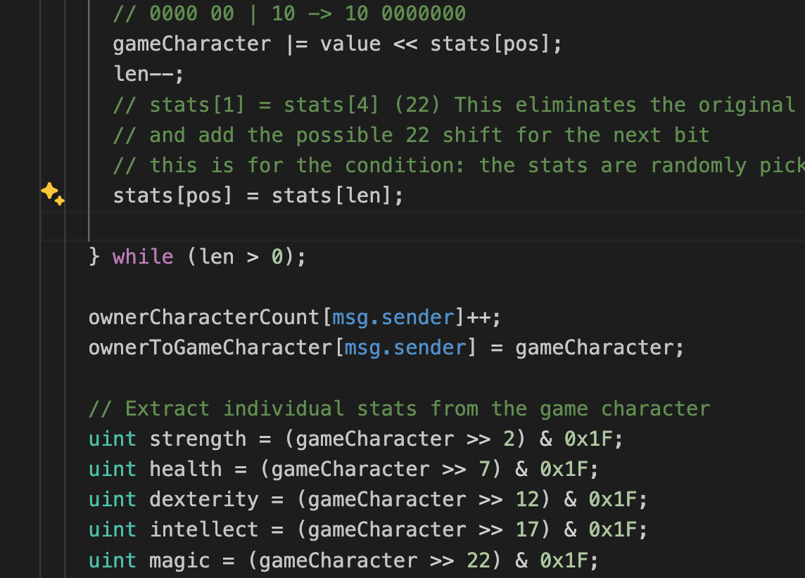

# Managing ethereum data and solidity algorism

In a lot of languages, we usually think an entity as an object. In a blockchain, entities are represented as uint.

Instead of thinking an entity like this...

```js
{
  type: 'Magician',
  properties: [12, 23, 12, 11],
  level: 3
}
```

The block in the binary represents information regarding the entity.

```text
x0..... 00 010101 011101 111011 001101 11
```

In solidity, we need to do a lot of binary operations to be efficient without overflowing the block and loosing data. This leads to less on-chain storage and computation cost.


